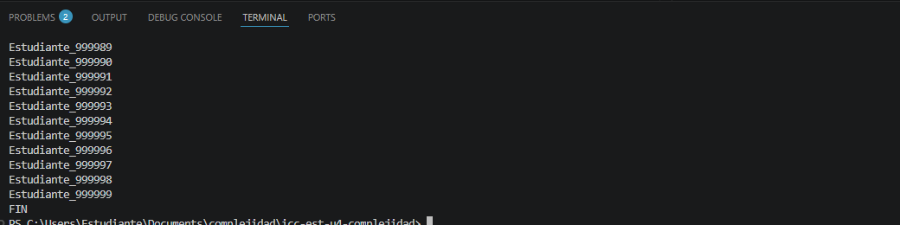

# Práctica: [04.01 Complejidad Prooyecto JAVA]

## Datos del Estudiante
- **Nombre:** [Erick joel Chang Calle]
- **Curso:** [Estructura de Datos G2]
- **Fecha:** [14/03/2026]

---
## 1. icc-est-u4-complejidad

**Fecha:** 14/04/26
**Descripción:** Cree el poryecto y subimos a GITHUB

---

## 2. icc-est-u4-complejidad

**Fecha:** 15/04/26
**Descripción:** Creamos la clase estudiante y generador y cremos un listado de estudiante con datos aleatorios
para buscar y optimizar la busqueda.
